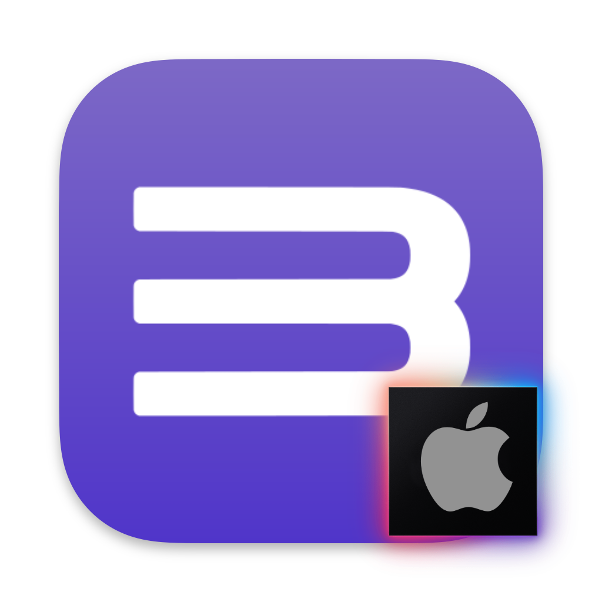

# Build Script for RPCS3 - Arm

This script will compile an Arm64 build of the PlayStation 3 Emulator RPCS3 for modern M-Series Macs. 

> [!WARNING]
> The script is provided for experimentation purposes only.  
> LLVM does not work on the Arm builds, so performane will be slow.  
> If you would like to play games, download the official x64 build [here](https://rpcs3.net/download) and run through Rosetta.

## Running the script

When downloaded, you probably won't be able to run the script at first. 

- If you get a message saying that the script can't be opened, right-click on it and select `Open` from the context menu. You should now get a new option to `Open` anyway. 

- The default application that is used to open the script might be set to a text editor. Change the default application by selecting the script and using `Command+I` to open the `Get Info` window (or right-click and select from the context menu). Under the `Open With:` section, if Terminal is not selected choose `Other`, enable `All Applications` and navigate to `/Applications/Utilities/Terminal`. It should now open by double-clicking it. 

- The script was written for the `Zsh` shell environment. If run from the command line, use `zsh build_rpcs3.sh`. The script will not run using `sh build_rpcs3.sh`.

- If you have done the above steps and nothing happens when you run it, you may need to give it executable permissions. In Terminal, use the `cd` command to navigate to where the script is and enter `chmod +x build_rpcs3.sh`.  

Note that the script will perform all actions in the same folder you run it from (likely your `Downloads` folder), so you may need to give it permission to do so.

It will perform the following actions: 
- Check if Homebrew is installed, and install it if it isn't. 
- Homebrew requires the Xcode command-line tools to be installed, so it will request that.
- Check if the required Homebrew dependencies are installed. Update if they are, install if not.
- Check if `cubeb` is installed. Remove if present. 
- Clone the Github repository source code and build the app bundle
- Codesign the app bundle to run locally
- The app bundle will be called `RPCS3-Arm.app` and it will replace any older build with the same name in the same folder. 
- Delete the source folder
- Reinstall `cubeb` if it was already present and removed earlier.

## Setting up the emulator

The fast LLVM recompiler currently does not work, so the slower interpreter must be used. 
In the `CPU` tab in the settings: 
- Change the PPU Decoder to Interpreter (static)
- Change the SPU Decoder to Interpreter (dynamic)

Before trying to run a game, always look up the [RPCS3 Compatibility list](https://rpcs3.net/compatibility) to check the recommended settings. Settings can be saved on a per-game basis by right-clicking a game and creating a new custom configuration from global settings.

> [!Note]
> When trying to play the Ratchet & Clank 1-3 series, in the Settings `Advanced` tab the `Disable MSL Fast Math` option should be selected to prevent graphical corruption.  This is not mentioned on the compatibility page.

## Known issues

These are issues with building RPCS3 or for Arm in general. They should be removed over time as the core issues get resolved. Issues include: 
- Build failure if `cubeb` is installed in homebrew (workaround in script)
- Build failure with updated versions of ffmpeg (workaround in script)
- Qt Frameworks are not bundled, so the app is not portable
